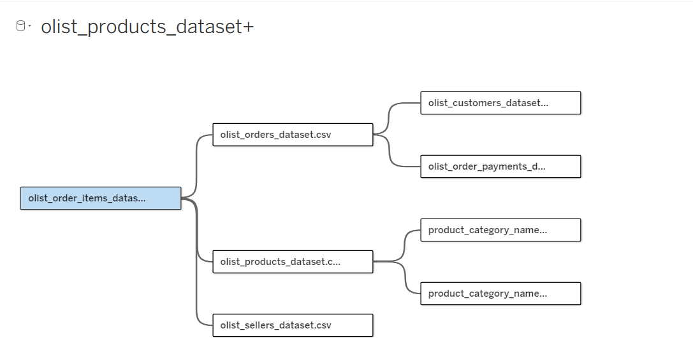
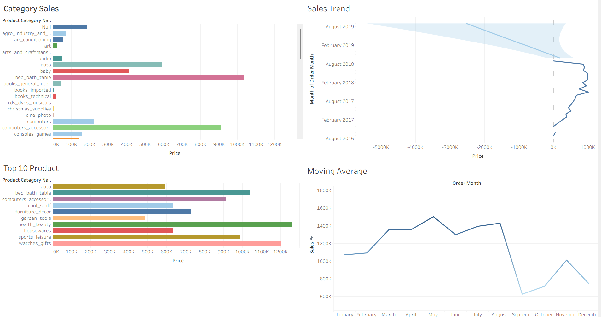
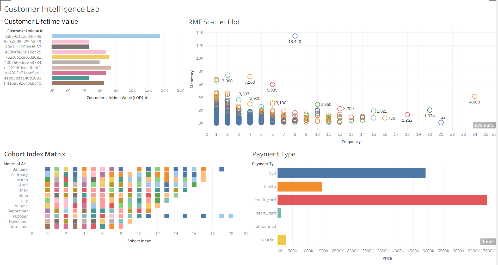
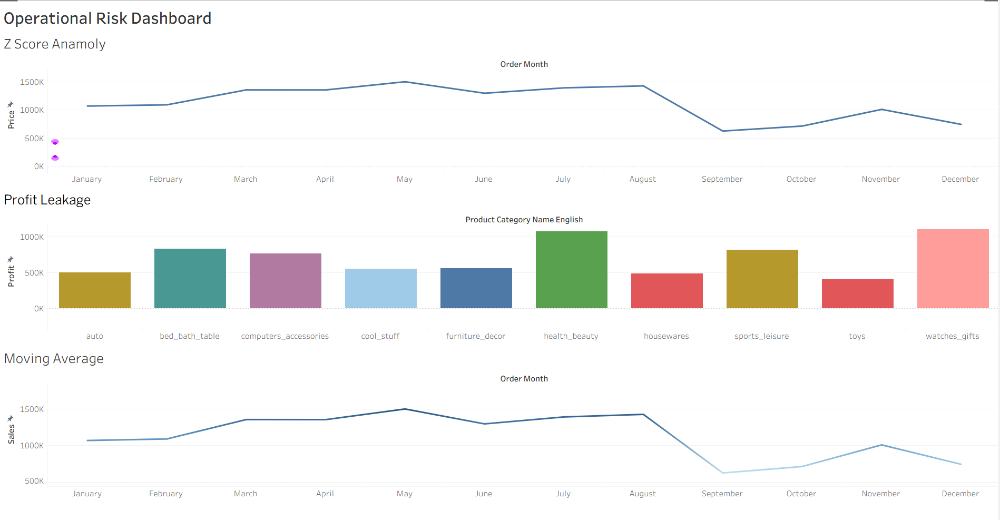

# Customer Intelligence & Revenue Analytics Platform

<div align="center">

**An enterprise-scale Tableau Business Intelligence solution for e-commerce performance monitoring, customer analytics, forecasting, segmentation, and operational risk detection.**


</div>

---

## Overview

Modern e-commerce organizations generate large volumes of transactional, customer, product, and payment data. This project transforms the Brazilian E-Commerce Public Dataset (Olist) into an enterprise-ready analytics platform built in Tableau Desktop.

The solution demonstrates how raw multi-table business data can be modeled, enriched, and visualized to support executive decision-making. It combines dimensional modeling, customer intelligence, cohort analysis, predictive forecasting, clustering, and operational monitoring into one cohesive Business Intelligence system.

---

## Business Problem

E-commerce teams often struggle with fragmented data and limited visibility across sales, customers, products, and operations. This makes it difficult to answer questions such as:

- Which products and categories drive revenue?
- How do customers behave over time?
- Which cohorts retain the best?
- What future sales trends should be expected?
- Which customer segments are most valuable?
- Where are operational risks and profit leaks emerging?

This project addresses those questions through a structured Tableau-based analytics platform.

---

## Key Highlights

- Designed a **Star Schema** for analytical processing
- Built a **customer intelligence layer** using LOD expressions
- Implemented **cohort retention analysis**
- Created **predictive sales forecasting** using exponential smoothing
- Performed **customer segmentation** with clustering and RFM logic
- Developed **operational risk monitoring** with anomaly detection
- Optimized performance using **extracts, context filters, and Hyper Engine**
- Produced **three enterprise dashboards** for executive, customer, and risk analysis

---

## Data Architecture

The dataset was modeled using a **Star Schema** approach to support scalable and efficient analytical reporting.

### Fact Layer
- Order items / transaction records
- Sales and purchase measurements

### Dimension Layer
- Customers
- Products
- Sellers
- Orders
- Payments
- Geography / location context
- Time-based attributes

### Why this matters
This structure improves:
- Analytical performance
- Data consistency
- Metric reuse
- Dashboard flexibility
- Query efficiency

---

## Architecture View



---

## Executive Dashboard

A high-level performance control panel for monitoring core business KPIs.

### Includes
- Total sales
- Total orders
- Average order value
- Sales trend with forecast
- Top-performing product categories
- Geographic performance analysis



---

## Customer Intelligence Lab

A customer-focused analytics workspace designed to understand retention, value, and segmentation.

### Includes
- Customer Lifetime Value (LOD)
- RFM scatter analysis
- Cohort retention matrix
- Payment type distribution

### Business use
This dashboard helps identify high-value customers, track engagement patterns, and evaluate retention behavior across acquisition cohorts.



---

## Operational Risk Dashboard

A monitoring dashboard for identifying business anomalies and profitability issues.

### Includes
- Z-score anomaly detection
- Profit leakage analysis
- Monthly sales performance
- Payment behavior trends

### Business use
This dashboard highlights unusual sales movement, product-level leakage, and operational irregularities that may require intervention.



---

## Analytical Techniques Used

### Data Engineering
- Star schema modeling
- Surrogate key creation
- Logical table relationships
- SCD Type 2 simulation
- Extract-based optimization

### Advanced Analytics
- Level of Detail (LOD) expressions
- Cohort analysis
- Retention tracking
- Moving averages
- Rolling statistics
- Z-score anomaly detection

### Predictive Analytics
- Exponential smoothing forecasting
- Manual MAPE interpretation
- Trend estimation

### Customer Segmentation
- K-means clustering
- RFM modeling
- Customer value grouping

---

## Tableau Concepts Demonstrated

- Tableau architecture
- Hyper Engine
- Live vs Extract connection trade-offs
- Joining vs blending
- FIXED, INCLUDE, and EXCLUDE LOD expressions
- Performance recording
- Context filters
- Forecast modeling
- Dashboard design and layout strategy

---

## Business Impact

This project converts raw e-commerce transaction data into a decision-support system that enables:

- Revenue monitoring
- Customer retention analysis
- Value-based segmentation
- Product performance review
- Forecast-driven planning
- Operational risk detection
- Executive reporting

It demonstrates how Tableau can be used as a true enterprise BI platform rather than just a visualization tool.

---

## Repository Contents

```text
Customer-Intelligence-Revenue-Analytics-Platform/
├── assets/
│   ├── architecture.png
│   ├── executive_dashboard.png
│   ├── customer_intelligence_lab.png
│   └── operational_risk_dashboard.png
├── Report Tableau.pdf
├── B23CM1003(1).twb
└── README.md
````

---

## Tools & Technologies

* Tableau Desktop
* Tableau Public
* Tableau Hyper Engine
* Brazilian E-Commerce Public Dataset (Olist)

---

## Skills Demonstrated

Business Intelligence • Tableau • Data Warehousing • Dimensional Modeling • Customer Analytics • Cohort Analysis • Forecasting • RFM Segmentation • K-Means Clustering • Statistical Analysis • Dashboard Design • Performance Optimization • Operational Analytics

---

## Conclusion

This project showcases the design and implementation of a professional-grade Tableau Business Intelligence system for e-commerce analytics. By combining data modeling, advanced calculations, predictive analytics, customer segmentation, and performance-aware dashboard design, the project demonstrates how raw data can be transformed into actionable business intelligence.

---

## Author

**Aditya Kashyap**

Data Visualization • Business Intelligence • Analytics

